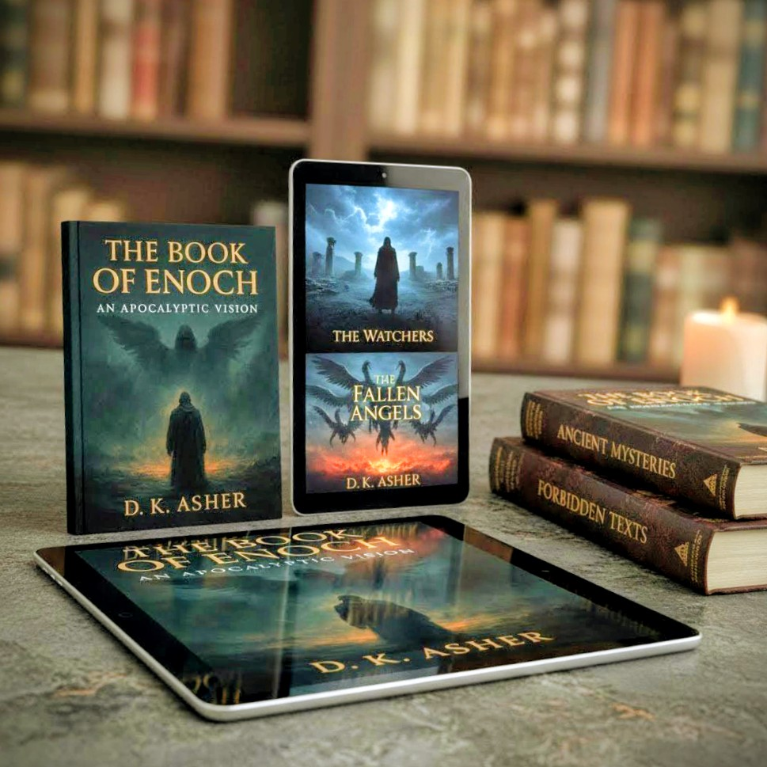
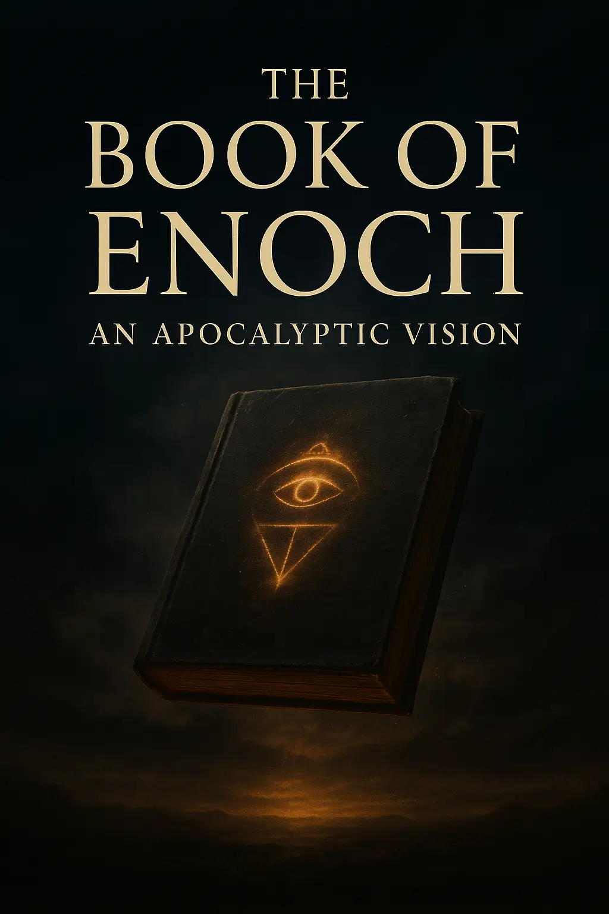
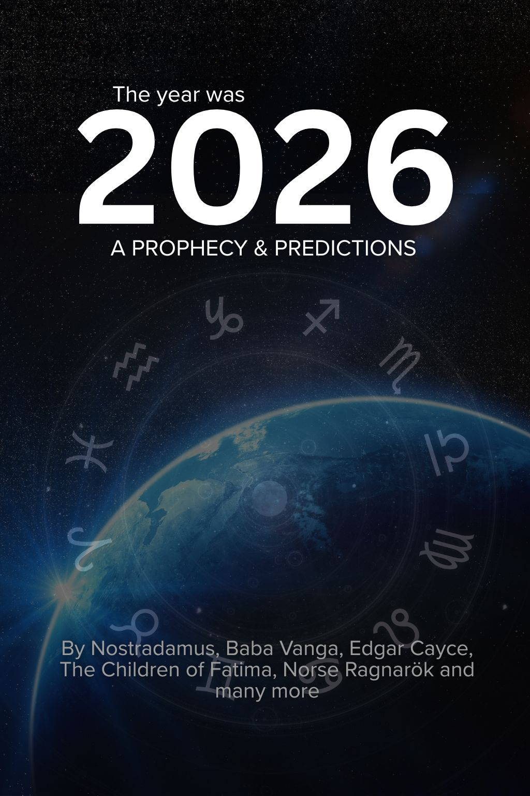

---
hide:
  - toc

title: Froogz — We bring back what was forgotten.
description: Unearth the secret knowledge they don't want you to find.
keywords:
  - Book of Enoch
  - ancient prophecy
  - banned books
  - hidden knowledge
  - religious text
  - Hidden Knowledge
  - Dead Sea Scrolls
---

<section class="g-hero">
  

    

      <!-- Center device -->
      
      <!-- Optional date pill -->
      

        

          Sept
          03
        

        Released
      

      <!-- Optional round chip (icon placeholder) -->

    

  

  

    
Rediscover the forbidden

    <h1 class="g-hero__title">Unveiling The Forgotten</h1>
    

      For centuries, entire books were erased from the story of faith and history. Hidden in vaults, dismissed as dangerous, and whispered about in fragments, these texts were nearly lost. But shadows don’t silence words forever — they wait to be rediscovered.
    

    

      <a class="g-hero__btn g-hero__btn--primary" href="https://payhip.com/b/GlBx7">Get the Enoch Edition</a>
      <a class="g-hero__btn g-hero__btn--ghost" href="https://midnightmanuscripts.store/preview/GlBx7">Read a preview</a>
    

  

</section>

### Why It Matters

The Book of Enoch is one of the most talked-about forbidden scriptures. Readers ask:

### Why was the Book of Enoch removed from the Bible?

It was excluded from the biblical canon by early church leaders who feared its visions of angels, giants, and divine judgment challenged established doctrine.

### Why is the Book of Enoch banned or forbidden?

For over 1,000 years it was hidden because of its apocalyptic prophecies, its stories of fallen angels, and its unsettling secrets about the end of days.

### What is the big deal about the Book of Enoch?

It gives a vivid vision of heaven, cosmic battles, and moral warnings that echo issues still relevant today: unrestrained power, corrupted justice, and the search for truth.

### Should I trust the Book of Enoch?

For historians and seekers, it is a window into ancient thought, not a replacement for scripture. It reveals how early believers struggled with questions of justice, creation, and divine mystery.

<section class="g-hero">
  

    

<section class="books-grid" aria-label="Books">

  <a class="book-card" href="thebookofenoch/">
    <figure class="thumb">
      
    </figure>
    <h3 class="book-title">The Book of Enoch</h3>
    
Step into the vision. Uncover what was lost. The end was always written.

  </a>

  <a class="book-card" href="theyearwas2026/">
    <figure class="thumb">
      
    </figure>
    <h3 class="book-title">The Year Was 2026</h3>
    
The chilling convergence of prophecies from sources across time, all pointing to a single year.

  </a>

</section>

</section>

!!! info "Did You Know?"

    :fontawesome-solid-book: Who Wrote the Book of Enoch?

    Tradition says it was written by Enoch, the great-grandfather of Noah. Scholars believe it was composed between 300 BCE and 100 CE, a collection of apocalyptic visions passed down through generations.

    :fontawesome-solid-book: Is the Book of Enoch true?

    Historically, it is a preserved record of ancient beliefs and prophecies. Spiritually, its truth depends on the seeker’s path.

    :fontawesome-solid-book: Who removed it from the Bible?

    Early church councils and leaders, who chose to preserve a narrower canon, left it out.

These aren’t just lost pages. They are crossroads — between faith and myth, history and speculation, the known and the hidden.

## **Step Into the Vision**

**The Official Froogz Mission:**
At Froogz, we bring back what was forgotten: apocalyptic visions, forbidden scriptures, and stories too dangerous to stay buried. We believe the deepest truths of the future are hidden in the knowledge of the past.

**Start Your Journey of Forbidden Knowledge:**
Start your journey by witnessing the origin story of prophecy itself with **The Book of Enoch: An Apocalyptic Vision**. Uncover the secrets of the Watchers, the Nephilim, and the Flood—the biblical history they tried to erase.

**Then, See the Prophecy Fulfilled:**
Continue into the immediate future with **The Year Was 2026: A Prophecy & Predictions**. This is not guesswork. This is the chilling convergence of prophecies from sources removed by thousands of miles and centuries of time—from Nostradamus to Baba Vanga—all pointing to the same critical year.

Don't just read history. Prepare for it.
