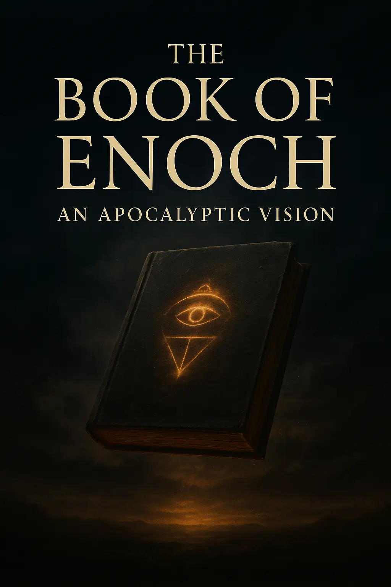
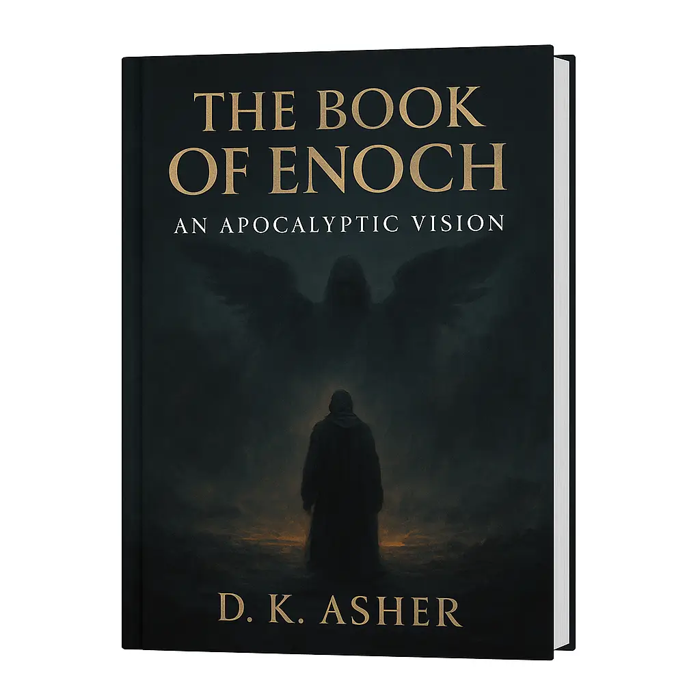

---
hide:
  - feedback
---

# The Book of Enoch: An Apocalyptic Vision

For over a thousand years, this book was hidden. Forbidden. Whispered about, but never read. Now it returns — not as dry history, but as a living vision.

  <section class="book-hero" aria-label="The Book of Enoch: An Apocalyptic Vision">
  <figure class="thumb">
    <!-- go UP one level from /thebookofenoch/ to /  -->
    
  </figure>

  <h1 class="book-title">The Book of Enoch: An Apocalyptic Vision</h1>
  
Step into the vision. Uncover what was lost. The end was always written.

  

    <a href="https://payhip.com/b/GlBx7"
       class="payhip-buy-button"
       data-theme="green"
       data-product="GlBx7">Buy Now</a>
  

</section>

**The Book of Enoch: An Apocalyptic Vision** pulls you into a world where angels descend, giants walk the earth, and the heavens themselves reveal their machinery. Here you’ll find rebellion, judgment, and hope stitched into fifteen haunting chapters that refuse to let you go.

**Inside, you’ll uncover:**

- The Watchers’ fall and the birth of the Nephilim.
- Prophecies erased from history.
- Secrets of a 364-day cosmic calendar.
- Visions of the Messiah and a final age of eternity.

This isn’t a neat tale. It’s unsettling. It’s alive. And once you open its pages, you’ll see why it was kept in shadows for centuries.

!!! info "Did You Know?"

    :fontawesome-solid-book: Why was the Book of Enoch removed from the Bible?
    It was excluded by early church councils due to its radical visions.

    :fontawesome-solid-book: Is the Book of Enoch forbidden?
    Yes, for centuries it was suppressed — yet it survived in Ethiopia and fragments in the Dead Sea Scrolls.

    :fontawesome-solid-book: Did Jesus mention the Book of Enoch?
    Not directly, but his followers quoted it.

    :fontawesome-solid-book: Is it safe to read the Book of Enoch?
    It is not “dangerous,” but it is challenging. Reading it is about discovery, not doctrine.

!!! quote "Testimonials"

    I wasn’t sure what to expect, but this book got under my skin. The imagery is haunting, the pace unpredictable, and I kept thinking about it long after I finished. It feels less like reading and more like uncovering something I wasn’t supposed to see.

    — Alex M., 29

    I’ve read a lot of apocryphal texts, but nothing written like this. It’s cinematic, it’s unsettling, and it’s alive. The calendar section alone made me question everything I thought I knew. froogz is onto something.

    — Rachel T., 34

    Not a comfortable read… and that’s exactly the point. Every chapter felt like a riddle that didn’t want to be solved. The Watchers, the visions, the final prophecy—it left me curious, and honestly a little shaken.

    — David R., 41

  <section class="book-hero" aria-label="The Book of Enoch: An Apocalyptic Vision">
  <figure class="thumb">
    <!-- go UP one level from /thebookofenoch/ to /  -->
    
  </figure>

  <h1 class="book-title">The Book of Enoch: An Apocalyptic Vision</h1>
  
Step into the vision. Uncover what was lost. The end was always written.

  

    <a href="https://payhip.com/b/GlBx7"
       class="payhip-buy-button"
       data-theme="green"
       data-product="GlBx7">Buy Now</a>
  

</section>

!!! info "Did You Know?"

    :fontawesome-solid-book: Having a copy of the Book of Enoch helps you understand the New Testament! It's believed that Jesus, the apostles, and other early Christians were familiar with its writings. It provides a missing puzzle piece for understanding references to the "Son of Man," fallen angels, and the "Lake of Fire."

    :fontawesome-solid-book: The Book of Enoch offers a detailed account of the Nephilim—the mysterious giants mentioned in Genesis 6. It’s one of the only ancient texts that fully explains the story of these beings, providing a rich narrative that fills in the brief biblical mention.

    :fontawesome-solid-book: For scholars and historians, the Book of Enoch is a critical piece of evidence for understanding the development of both Judaism and Christianity. It's considered one of the earliest examples of apocalyptic literature and a valuable resource for tracing the evolution of religious thought.

# Faith, Mystery, and the Voices of the Silenced

Some warn: “Why stay away from the Book of Enoch?” or “Why do people say not to read it?”

The truth is that the Book of Enoch challenges, provokes, and raises uncomfortable questions. That is exactly why it survived in fragments, quoted even in the New Testament.

**What did Jesus say about the Book of Enoch?**

While Jesus never directly mentions it, New Testament writers like Jude and Peter reference its themes.

**Do Christians accept the Book of Enoch?**

Most mainstream denominations do not, but it remains part of the canon in the Ethiopian Orthodox Church.

You will get a PDF (5.5MB) optimized file. Other formats will be availabe soon.
