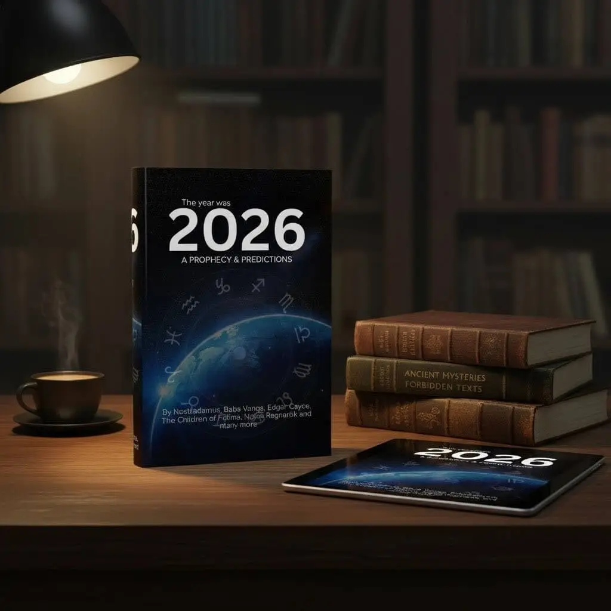
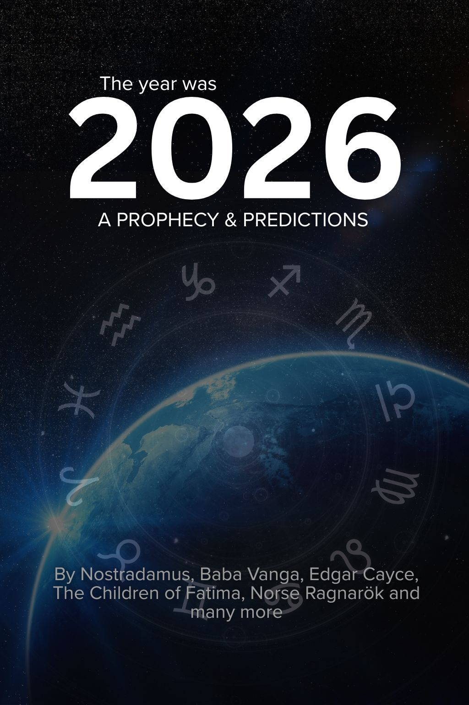

---
hide:
  - feedback
---

<section class="g-hero">
  

    

      
      

        

          Oct
          19
        

        Released
      

    

  

  

    
The critical date is set

    <h1 class="g-hero__title">The Year Was 2026: A Prophecy and Predictions</h1>
    

      For centuries, the world’s most famous seers—from Nostradamus to Baba Vanga—delivered veiled warnings about the near future. Now, the chilling convergence of their prophecies points to a single, critical year. Stop searching. Start preparing.
    

    

      <a class="g-hero__btn g-hero__btn--primary" href="https://payhip.com/b/gyokn">Uncover the Predictions Now</a>
      <a class="g-hero__btn g-hero__btn--ghost" href="[PREVIEW_LINK_2026]">Read a Preview</a>
      

  

</section>

---

# The Essential Handbook for the Immediate Future

The future is not a mystery—it is a convergence. After unlocking the ancient visions of Enoch, you are ready to see where the path leads: a single, critical year.

**The Year Was 2026** is the essential handbook for the immediate future. It cuts through sensationalism to deliver the core warnings from the most famous prophets, all aligning on the same critical time horizon. The future is no longer vague; it is approaching fast.

**Inside, you’ll find the chilling alignment of predictions from:**

- **Nostradamus:** Decoded quatrains revealing a major global power shift and the "Great Fire" cycle.
- **Baba Vanga:** Her darkest predictions concerning climate, ecological disaster, and the fate of the West.
- **Edgar Cayce:** The sleeping prophet's trance readings on the shifting axis and sudden geographical changes.
- **The Children of Fátima:** The urgent, unheeded messages that speak directly to the political and spiritual state of the modern world.

This is the book for those who feel the unease and want to be ready for what's coming. **Don't just witness the year 2026—be prepared for it.**

!!! info "The Convergence is Real"

    :fontawesome-solid-timeline: **Why 2026?** Different prophecies using wildly different calendars (celestial, spiritual, political) unexpectedly align on this specific year, suggesting an external force driving global events.

    :fontawesome-solid-users: **Who Are These Seers?** This collection focuses on famous and verified sources known for their unsettling accuracy: the mystic Nostradamus, the blind Bulgarian prophetess Baba Vanga, the trance-inducing Edgar Cayce, and the spiritual warnings of Fátima.

    :fontawesome-solid-book: **Are These Predictions Vague?** Absolutely not. We decode the abstract language of prophecy into concrete, geopolitical, and spiritual predictions so you can clearly understand the stakes.

!!! quote "Testimonials"

    I read this right after finishing Enoch, and it felt like the perfect bridge. The connections the author drew between these ancient and modern predictions for 2026 are genuinely chilling. It's not a comfortable read, but it is necessary.

    — Sarah K., 38

    The section on Baba Vanga’s environmental predictions made my stomach drop. This is the book you read when you want the unvarnished truth about the near future. It’s dense, well-researched, and pulls no punches. Highly recommend.

    — Leo P., 45

    I appreciated that the book didn't just scare you; it made you think critically about history and prophecy. It’s the ultimate guide for anyone who feels the world is on a new, urgent clock. froogz is my new source for forgotten truths.

    — Tina V., 29

<section class="book-hero" aria-label="The Year Was 2026: A Prophecy and Predictions">
  <figure class="thumb">
    
  </figure>

  <h1 class="book-title">The Year Was 2026: A Prophecy and Predictions</h1>
  
The chilling convergence of prophecies from seers across time, all pointing to a single year.

  

    <a href="https://payhip.com/b/gyokn"
       class="payhip-buy-button"
       data-theme="blue"
       data-product="gyokn">Get Instant Access</a>
  

</section>

!!! info "Why This Matters"

    :fontawesome-solid-map-location-dot: **Geopolitical Insights:** The prophetic alignment suggests a massive reshuffling of global alliances. Understanding these shifts is key to navigating the next few years.

    :fontawesome-solid-mountain-sun: **Personal Preparedness:** Knowing the potential impact of economic or environmental events allows you to make informed choices now, mitigating future risk.

    :fontawesome-solid-hands-holding-heart: **Spiritual Clarity:** Prophecy often serves as a map. Reading these texts provides context for current events, easing confusion and replacing fear with understanding.

**File Information:** You will get a PDF (5.5MB) optimized file. Other formats will be available soon.
