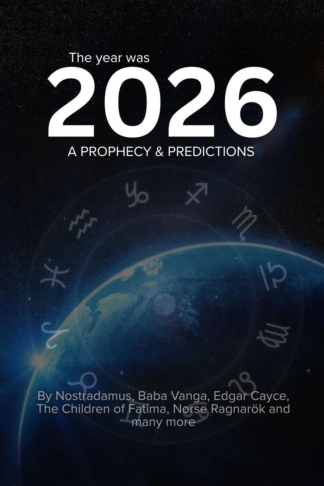

---
hide:
  - feedback
---

<section class="g-hero">
  

    

      
      

        

          Oct
          19
        

        Release Date
      

    

  

  

    
The Time Is Running Out

    <h1 class="g-hero__title">The Year Was 2026: A Prophecy and Predictions</h1>
    

      For centuries, the world’s most famous seers—from <strong>Nostradamus</strong> to <strong>Baba Vanga</strong>—delivered veiled warnings about the near future. Now, the chilling data reveals the <strong>critical year</strong>. Stop searching for answers. <strong>Start preparing.</strong>

    

      <a class="g-hero__btn g-hero__btn--primary" href="https://payhip.com/b/gyokn">Get It Now</a>
      <a class="g-hero__btn g-hero__btn--ghost" href="https://payhip.com/b/gyokn">Instant Download</a>
      

  

</section>

---

## The Essential Handbook for the Immediate Future

The future isn't a vague fog of "maybe"—it's a **countdown clock**. You've already got the key to ancient visions; now it's time to see the single, critical destination they all point toward.

**The Year Was 2026** is the non-negotiable handbook for the moment we're in. We cut through the noise and sensationalism to deliver the core, decoded warnings from history’s most renowned prophets, all mysteriously aligning on the same tight time horizon. The vague future? It's over. The **immediate future** is approaching **faster than you think**.

**Inside this definitive guide, you’ll find the unsettling alignment of predictions from:**

- **Nostradamus:** Quatrains decoded to reveal the exact timeframe for a major **Global Power Shift** and the terrifying "Great Fire" cycle.
- **Baba Vanga:** Her darkest, most concrete predictions on the coming **Ecological Disaster** and the shocking fate that awaits the West.
- **Edgar Cayce:** The "Sleeping Prophet’s" trance readings on the **Shifting Earth Axis** and sudden, dramatic geographical changes that are already starting.
- **The Children of Fátima:** The urgent, spiritual warnings that were deliberately unheeded, now speaking directly to the **political and moral crisis** of our modern world.

This isn't just a book; it's a **field guide for the uncertain years ahead**. If you feel that collective global unease, this is your chance to turn it into **informed action**. **Don't just witness the year 2026—be ready to master it.**

!!! info "The Convergence is Unmistakable"

    **Why 2026?** This is the ultimate enigma: Major prophecies—using wildly different calendars (celestial, spiritual, political)—all unexpectedly *converge* on this one specific year. This isn't coincidence; it suggests an **external, undeniable force** driving global events.

    **Who Are These Seers?** We didn't choose fortune-tellers. This collection focuses exclusively on **famous, verified sources** known for their unsettling accuracy: the cryptic Nostradamus, the eerily accurate Baba Vanga, the trance-inducing Edgar Cayce, and the urgent spiritual warnings of Fátima.

    **Are These Just Vague Ideas?** We tossed the abstraction. We decode the poets' language into **concrete, geopolitical, and personal predictions**. You will finally see the clear, specific stakes.

<section class="book-hero" aria-label="The Year Was 2026: A Prophecy and Predictions">
  <figure class="thumb">
    
  </figure>

  <h1 class="book-title">The Year Was 2026: A Prophecy and Predictions</h1>
  
The chilling convergence of prophecies from seers across time, all pointing to <strong>the same, single year</strong>.

  

    <a href="https://payhip.com/b/gyokn"
       class="payhip-buy-button"
       data-theme="blue"
       data-product="gyokn">Download and Prepare</a>
  

</section>

!!! info "Why Understanding 2026 is Vital"

    **Geopolitical Insights:** The prophetic alignment isn't just a warning—it's a map to a massive reshuffling of global alliances. Understanding these key shifts is your competitive edge for navigating the next decade.

    **Personal Preparedness:** Knowing the potential impact of major economic or environmental resets empowers you to make **informed, tangible choices right now**, mitigating risk before it’s too late.

    **Spiritual Clarity:** Prophecy isn't meant to cause fear; it's a lifeline. Reading these decoded texts provides essential context for the chaos we see every day, replacing confusion and anxiety with genuine **understanding and peace**.

**File Information:** Your immediate download is a **PDF (5.5MB)** optimized for all devices. Other formats are coming soon, but the time to read this is **now**.

---

## **The Final Warning**

The signs are everywhere—the financial tremors, the political friction, the shifts in the climate. These are not isolated incidents; they are the drumbeats leading to the inevitable crescendo. **2026 is not a theory. It is the date on the calendar.**

You have the opportunity now to look behind the curtain, to see what the most accurate seers saw, and to **make your move before the world realizes the game has changed.**

The truth is waiting. But for how much longer?

**Don't let the coming year find you unprepared. The window is closing.**

  <a class="g-hero__btn g-hero__btn--primary" href="https://payhip.com/b/gyokn" style="margin-top: 20px;"><strong>Secure Your Copy Before Time Runs Out</strong></a>

